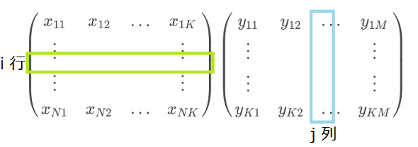

```{r setup, include=FALSE}
knitr::opts_chunk$set(echo = FALSE)
```

## ベクトル

数のリストを「ベクトル」といい、次のように書きます。
\[ x = (x_1, x_2, \dots, x_N) \]
この場合$N$個のリストなので「$N$次ベクトル」や「$N$-ベクトル」と呼びます。

$x$ が$N$次の実数ベクトルであることを $x \in \mathbb{R}^N$ と書きます。
整数や複素数の場合には $\mathbb{Z}$ や $\mathbb{C}$ を用いて同様に表記します。

## ベクトル

### 足し算・引き算

ベクトル同士の加減は各要素ごとの演算です。
ただしサイズが同じでなければいけません。
\[ x + y = (x_1 + y_1, x_2 + y_2, \dots) \]
\[ x - y = (x_1 - y_1, x_2 - y_2, \dots) \]


### スカラー倍

複数要素のない普通の実数のことを、ベクトルと区別して「スカラー」と呼びます。
ベクトルの「スカラー倍」とは、各要素にスカラーを掛ける演算です。
\[ a x = (a x_1, a x_2, \dots)\]


## ベクトル

### 内積

二つのベクトルの「内積」とは、要素ごとを掛け合わせてから
すべてを足しあげる演算です。
内積は、通常 $\cdot$ や $<\;\;>$ などを用いて表記します。 

\[ x \cdot y = <x,y> = \sum_{i} x_i y_i \]


## ベクトル

### ノルム

同じベクトル同士の内積の平方根のことを「ノルム」または
「ユークリッドノルム」と呼び、 $|| \;\; ||$ で表記します。
ベクトルの原点からの距離と解釈できます。

\[ ||x|| = \sqrt{x \cdot x} = \sqrt{ \sum_{i} x_{i}^{2} } \]


定義より、ノルムは必ず非負で、全要素がゼロであるときのみゼロになります。
$$
\begin{aligned}
 ||x|| \ge 0 & \;\;\;\; \text{for any $x$} \\
 ||x|| = 0   & \;\;\;\; \text{if and only if $x = 0$} 
\end{aligned}
$$


## ベクトル

### 線形独立・従属

ベクトルの集合において、あるベクトルがその他のベクトルの線形結合により
表現できるとき、その集合は「線形従属」であるといいます。  
どのベクトルもその他のベクトルの線形結合では表せないとき、
その集合は「線形独立」であるといいます。

正式には、$v_1, v_2, \dots, v_p$
をベクトル（添え字が要素でないことに注意）とするときに、
\[ a_1 v_1 + a_2 v_2 + \cdots + a_p v_p = 0 \]
が成立し、かつ少なくとも１つは非ゼロであるような
スカラーの組み合わせ $a_1, a_2, \dots, a_p$ が存在するなら、
$v_1, v_2, \dots, v_p$ は線形従属です。
上の数式が成立するのは $a_1 = a_2 = \cdots = a_p = 0$ の場合に限る場合、
$v_1, v_2, \dots, v_p$ は線形独立です。


## ベクトル

### 線形独立・従属

- 例. 次の $x, y, z$ は線形従属です。
\[ 
x = \begin{pmatrix}
     1 \\ 2 \\ 3
    \end{pmatrix},
y = \begin{pmatrix}
     3 \\ 2 \\ 1 
    \end{pmatrix},
z = \begin{pmatrix}
     -1 \\ 0 \\ 1
    \end{pmatrix}
\]


- 例. 次の $x, y, z$ は線形独立です。
\[ 
x = \begin{pmatrix}
     1 \\ 0 \\ 0 
    \end{pmatrix},
y = \begin{pmatrix}
     0 \\ 1 \\ 0 
    \end{pmatrix},
z = \begin{pmatrix}
     0 \\ 0 \\ 1
    \end{pmatrix}
\]


## 行列

数が一列ではなく縦横に格子状に並んでいるものを「行列」といいます。

\[
    \begin{pmatrix}
    x_{11} & x_{12} & \dots  & x_{1M} \\
    \vdots & \ddots &        & \vdots \\
    \vdots &        & \ddots & \vdots \\
    x_{N1} & x_{N2} & \dots  & x_{NM} 
    \end{pmatrix}
\]


この場合、$N \times M$ 行列です。実数であれば $X \in \mathbb{R}^{N \times M}$
と表現します。

ベクトルは、行列の特殊ケースとみなすことができます（$N$または$M$が1）。
縦の要素数が1の場合を「行ベクトル」、
横の要素数が1の場合を「列ベクトル」と呼び区別します。


## 行列

### 足し算・引き算

行列同士の加減は各要素ごとの演算です。
ただしサイズが同じでなければいけません。
\[ 
X + Y = \begin{pmatrix}
    x_{11}+y_{11} & \dots  & x_{1M}+y_{1M} \\
    \vdots & \ddots & \vdots \\
    x_{N1}+y_{N1} & \dots  & x_{NM}+y_{NM} 
    \end{pmatrix}
\]

\[ 
X - Y = \begin{pmatrix}
    x_{11}-y_{11} & \dots  & x_{1M}-y_{1M} \\
    \vdots & \ddots & \vdots \\
    x_{N1}-y_{N1} & \dots  & x_{NM}-y_{NM} 
    \end{pmatrix}
\]


## 行列

### スカラー倍

行列のスカラー倍も、各要素にスカラーを掛けます。
\[ 
aX = \begin{pmatrix}
    a x_{11} & \dots  & a x_{1M} \\
    \vdots   & \ddots & \vdots \\
    a x_{N1} & \dots  & a x_{NM}
    \end{pmatrix}
\]


## 行列

### 転置

行列の行と列を入れ替える操作を「転置」といい、$X'$ や $X^T$ で表します。
\[
X' = X^T = 
    \begin{pmatrix}
    x_{11} & x_{21} & \dots  & x_{N1} \\
    \vdots & \ddots &        & \vdots \\
    \vdots &        & \ddots & \vdots \\
    x_{1M} & x_{2M} & \dots  & x_{NM} 
    \end{pmatrix}
\]


## 行列

### 掛け算

行列の掛け算は複雑です。前提として、$XY$を計算するには
$X$の横のサイズと$Y$の縦のサイズが一致している必要があります。
行列の積 $XY$ の $(i,j)$ 要素は次のように定義されます。
\[
(XY)_{i,j} = \sum_{k} x_{i,k} y_{k,j}
\]

## 行列

### 掛け算

\[
(XY)_{i,j} = \sum_{k} x_{i,k} y_{k,j}
\]
つまり、$XY$ の $(i,j)$ 要素は、$X$ の$i$ 行と $Y$ の $j$ 列の内積です。



結果として、$XY$ のサイズは、
行数は$X$ の行数に一致し、列数は $Y$ の列数に一致します。


## 行列

### 掛け算

- 例.
\[
\begin{pmatrix}
  1&2\\3&4\\5&6
\end{pmatrix}
\begin{pmatrix}
  7&8\\9&10
\end{pmatrix}
= 
\begin{pmatrix}
  1 \cdot 7 + 2 \cdot 9 & 1 \cdot 8 + 2 \cdot 10 \\
  3 \cdot 7 + 4 \cdot 9 & 3 \cdot 8 + 4 \cdot 10 \\
  5 \cdot 7 + 6 \cdot 9 & 5 \cdot 8 + 6 \cdot 10 
\end{pmatrix}
=
\begin{pmatrix}
  25&28\\57&64\\89&100
\end{pmatrix}
\]

- 大変なので計算はコンピュータに任せましょう。

```{r echo = TRUE}
matrix(1:6, ncol = 2, byrow = TRUE) %*%  matrix(7:10, nrow = 2, byrow = TRUE)
```


## 行列

### 掛け算の順序

行列の掛け算は計算の順序に依存しません。

\[XYZ = (XY)Z = X(YZ)\]

ただし、左右を入れ替えるのはだめです。
そもそもサイズが適合する保証もありません。

\[XY \not= YX\]

### 掛け算と転置行列

行列の積と転置には以下の関係があります。

\[ (XY)' = Y'X' \]

## 行列

### ベクトルの内積

ベクトルの内積は、行列の掛け算で表すことができます。
$x, y$ を同じサイズの列ベクトルとして、

\[ x \cdot y = \sum_{i}x_i y_i  = x' y \]


## 行列

### 正方行列

行と列のサイズが同じ行列のことを「正方行列」といいます。
\[ 
X = \begin{pmatrix}
    x_{11} & \dots  & x_{1N} \\
    \vdots & \ddots & \vdots \\
    x_{N1} & \dots  & x_{NN} 
    \end{pmatrix}
\]

## 行列

### 単位行列

対角要素のみが1でそれ以外が0の正方行列を「単位行列」といいます。
通常 $I$ と書くか $I_N$ のようにサイズを明らかにして表記します。

\[ 
I  = \begin{pmatrix}
    1 & 0  & \dots & 0 \\
    0 & \ddots & & \vdots\\
    \vdots &  & \ddots & 0\\
    0 & \dots & 0  & 1 
    \end{pmatrix}
\]

単位行列は、どんな行列にかけても値を変えないという性質があります。
ただし積の定義できるサイズであることが前提です。
\[ X I = I X = X \]


## 行列

### 逆行列

ある正方行列について、掛けると単位行列になるような行列のことを「逆行列」
といい、$X^{-1}$ と書きます。

逆行列が存在する場合、左から掛けても右から掛けても結果は単位行列になります。
\[ XX^{-1} = X^{-1}X = I \]

ただし、すべての正方行列に対して逆行列が存在するわけではありません。


## 行列

### 逆行列の性質

存在する場合、逆行列は一意です。
\[ \text{$XA = I$ かつ $XB = I$} \Rightarrow A = B \]


$X$ が逆行列をもつなら、転置行列との間には次の関係があります。

\[  (X')^{-1} = (X^{-1})' \]


$X, Y$ がともに逆行列をもつなら、逆行列と積の間には次の関係があります。

\[ (XY)^{-1} = Y^{-1} X^{-1} \]


## 行列

### 逆行列の存在条件

正方行列 $X$ について、次の各命題は同値です。

1. $X$ の逆行列が存在する
2. $X$ の各列は線形独立である
3. 任意の $v \not= 0$ について、$Xv \not= 0$。
ただし$v$ は$X$ の列数と同じサイズの列ベクトルとする。

## 行列

1. $X$ の逆行列が存在する。
2. $X$ の各列は線形独立である。
3. 任意の $v \not= 0$ について、$Xv \not= 0$。
ただし$v$ は$X$ の列数と同じサイズの列ベクトルとする。


### 2 $\Leftrightarrow$ 3 の証明

$X = (X_1, X_2, \dots, X_N)$ と列ベクトルに分解して書く。
すると
\[
Xv = (X_1, \dots, X_N) (v_1, \dots, v_N)' = \sum_j v_j X_j
\]
したがって、任意の $v \not= 0$について、
\[ \text{2} \Leftrightarrow \sum_j v_j X_j \not= 0 \Leftrightarrow Xv \not= 0 \Leftrightarrow \text{3} \] 


## 行列

1. $X$ の逆行列が存在する。
2. $X$ の各列は線形独立である。
3. 任意の $v \not= 0$ について、$Xv \not= 0$。
ただし$v$ は$X$ の列数と同じサイズの列ベクトルとする。


### 1 $\Rightarrow$ 3 の証明

命題1を仮定する。
もし $Xv = 0$ であるなら、両辺に $X^{-1}$ を左からかけて
$v = 0$ を得る。したがって命題3が成立する。


### 2 $\Rightarrow$ 1 の証明

補遺に逆行列を実際に計算するアルゴリズムを紹介します。
このアルゴリズムは、$X$ の各列が線形独立なら正しく動くので、
結果的に逆行列の存在を証明したことになります。


## 線形回帰における行列

### 正規方程式の解

\[ (X'X) \beta = X'y \]

もし $X'X$ の逆行列が存在するなら、$\beta = (X'X)^{-1}(X'y)$ により一意に
解が定まります。


### $X'X$ の逆行列の存在条件

以下の2命題は同値です。

1. $X$ の各列が線形独立である。
2. $X'X$ は逆行列を持つ。


## 線形回帰における行列

### 補題

\[ X'Xv = 0 \Leftrightarrow Xv = 0 \]

#### 証明

$Xv = 0 \Rightarrow X'Xv = 0$ は自明。

$v'X'Xv$ を考える。
\[ v'X'Xv = (Xv)'(Xv) \]
もし $X'Xv = 0$ であれば、$(Xv)'(Xv) = 0$ となり、したがって$Xv=0$。


## 線形回帰における行列

### $X'X$ の逆行列の存在条件

1. $X$ の各列が線形独立である。
2. $X'X$ は逆行列を持つ。

#### 証明

任意の$v\not=0$ について、
\[ 
\text{2} \Leftrightarrow (X'X)v \not=0 
\Leftrightarrow Xv \not= 0 \Leftrightarrow \text{1}
\]


## 線形回帰における行列

### 線形従属な $X$ の例

定数項に加えて、男性ダミー・女性ダミーを用いるとします。

```{r}
X <- data.frame(const  = rep(1, 4),
                male   = c(1, 0, 0, 1),
                female = c(0, 1, 1, 0))
X <- as.matrix(X)
X
```

すると、`male + female = const` であるので、$X$ は線形従属になります。
したがって、$X'X$ の逆行列が得られません。

```{r echo = TRUE, error = TRUE}
solve(crossprod(X))
```

## 線形回帰における行列

### 線形従属な $X$ の例

説明変数の１つに円表示の価格をとり、別変数としてそのドル表示を用いるとします。
この場合、一方は他方に為替レートを掛けたものであるので線形従属になります。

```{r}
X <- data.frame(price_JPY = c(100, 110, 105, 99), 
                price_USD = c(100, 110, 105, 99)*110)
X <- as.matrix(X)
X
```

したがって、$X'X$ の逆行列を計算できません。

```{r echo = TRUE, error = TRUE}
solve(crossprod(X))
```

## 線形回帰における行列

### 線形従属な $X$ の例

為替レートが一定ではなければ厳密には線形従属ではなくなるものの、
変動が小さいならば数値的にエラーが生じます。

```{r}
set.seed(87)
X <- data.frame(price_JPY = c(100, 110, 105, 99), 
                price_USD = c(100, 110, 105, 99)*(110+runif(4)/10000))
X <- as.matrix(X)
X
```

```{r echo = TRUE, error = TRUE}
solve(crossprod(X))
```


# 補填

## 逆行列の計算アルゴリズム

$X$ を正方行列で、その列が線形独立であるとするときに、
$X$ の逆行列を求める。

準備として、３つの操作を定義する。

- Flip(i, j)
- Multiply(i, a)
- MultAndSubtract(i, j, a)


## 逆行列の計算アルゴリズム

### Flip(i, j)

$X$ の$i$ 列と $j$ 列を入れ替える。
列を入れ替えるだけなので、列間の線形独立性は保たれる。

この操作は、次の行列の掛け算で表現できる。

\[ 
X \leftarrow X A  
\]
where
\[ 
A_{p,q} = \begin{cases}
          1 & \text{if $p = q$ and $p \not= i, j$} \\
          1 & \text{if $p = i$ and $q = j$} \\
          1 & \text{if $p = j$ and $q = i$} \\
          0 & \text{otherwise}
          \end{cases}
\]


## 逆行列の計算アルゴリズム

### Multiply(i, a)

$i$ 列目にスカラー $a$ を掛ける。
$a \not= 0$ であれば、列間の線形独立性は保たれる。

この操作は、次の行列の掛け算で表現できる。

\[ 
X \leftarrow X A  
\]
where
\[ 
A_{p,q} = \begin{cases}
          a & \text{if $p = q = i$} \\
          1 & \text{if $p = q$ and $p \not= i$} \\
          0 & \text{otherwise}
          \end{cases}
\]


## 逆行列の計算アルゴリズム

### MultAndSubtract(i, j, a)

$i$ 列目にスカラー $a$ をかけたものを
$j$ 列目から差し引く。
$a \not= 0$ であれば、列間の線形独立性は保たれる。


この操作は、次の行列の掛け算で表現できる。

\[ 
X \leftarrow X A  
\]
where
$$
\begin{align*}
A &= I - B \\
B_{p,q} &= \begin{cases}
          a & \text{if $p = i$ and $q = j$} \\
          0 & \text{otherwise}
          \end{cases}
\end{align*}
$$

## 逆行列の計算アルゴリズム

以下のアルゴリズムは、行列 $X$ を単位行列に変換します。

### ToIdentity(X)

```{r echo = TRUE, eval = FALSE}
N <- nrow(X)
for i from 1 to N:
  if X[i,i] = 0:
    Find j such that j > i and X[i,j] != 0 ... (*)
    Flip(i, j)
  
  Multiply(i, 1/X[i,i])
  
  for j from 1 to N except for i:
    MultAndSubtract(i, j, X[i,j])

return X
```

(*) ... 線形独立性より必ず少なくともひとつは条件を満たす $j$ が存在する。


## 逆行列の計算アルゴリズム

`ToIdentity(X)` は、`Flip`, `Multiply`, `MultAndSubtract` の
3種類の操作を繰り返し適用することで、$X$ を単位行列に変換しています。
また、構成上必ず有限回の操作で終了します。

各操作は何らかの行列の掛け算で表現できるので、アルゴリズム全体は
次のように書けます。
\[ X A_1 A_2 \cdots A_M = I \]
ただし、$A_m$ は $m$ 個目の操作に対応する行列です。 

したがって、$X$ の逆行列が次のように見つかります。
\[ A_1 A_2 \cdots A_M = X^{-1} \]

実装したもの：[FindInverse.R](https://gist.github.com/kota7/8bfe810232edf614661253bd272f2840)
