```{r setup, include=FALSE}
knitr::opts_chunk$set(echo = FALSE)
```

```{r include=FALSE}
library(ggplot2)
library(dplyr)
library(splines)
library(reshape2)
set.seed(87)
```


## 概要

### 基底展開 (Basis expansion)

説明変数$X$に事前に変数変換を施すことで、より柔軟な関係を表現する 

### 正則化 (Regularization)

複雑な（自由度の高い）モデルに対して制約を課して過適合を是正する


```{r, echo=FALSE}
N <- 31
x <- seq(0, 1.8*pi, length = N)
y <- 0.3*x + 1.5*sin(x) + rnorm(N)
newdata = data.frame(x = seq(min(x), max(x), length = 200))
o1 <- lm(y ~ x); p1 <- predict(o1, newdata)
o2 <- lm(y ~ x + sin(x)); p2 <- predict(o2, newdata)
o3 <- lm(y ~ sin(x) + poly(x, 15)); p3 <- predict(o3, newdata)
dat1 <- data.frame(x, y)
dat2 <- lapply(1:3, function(i) newdata) %>% bind_rows()
dat2$y <- c(p1, p2, p3)
dat2$model <- sort(rep(1:3, nrow(newdata)))
g <- ggplot(dat1, aes(x, y)) +
  theme(panel.background = element_rect(fill = "grey97"),
        panel.grid.major = element_blank(),
        panel.grid.minor = element_blank(),
        axis.ticks = element_blank(),
        axis.text  = element_blank(),
        axis.title = element_blank(),
        strip.text.x = element_blank(), 
        strip.background = element_blank()) +
  geom_point(size = 2) + 
  geom_line(data = dat2, aes(x, y), color = "blue", size = 1.5, alpha = 0.5) + 
  facet_grid(~ model)
```

```{r echo=FALSE, fig.height=2.5, fig.width=9}
plot(g)
```


## ロードマップ

1. 基底展開とは？ (5.1)
1. 区分的多項式、スプライン、3次自然スプラインとは？ (5.2)
1. 3次自然スプラインを用いた特徴抽出 (5.3)
1. 平滑化スプライン (5.4 ~ 5.5)
1. ロジスティック回帰への応用 (5.6)


<br />
＊5.1の一部と5.3を除いて、$X$が1次元の場合を扱う

## 基底展開とは？


## 基底展開とは？

説明変数$X$に事前に変数変換を施すことで、より柔軟な関係を表現する
\[ f(X) = \sum_{j} \beta_j X_j \]

\[ \Longrightarrow f(X) = \sum_{k} \beta_k h_k(X) \]

変換後の変数について線形モデル
→これまでの手法がそのまま使える


## 基底展開の例

- 多項式回帰は基底展開の例 
\[ f(X) = \beta_0 + \beta_1 X + \beta_2 X^2 + \cdots  \]


### 問題に関する知識や想定に基づいて設定することも

- $X$の効果は減衰していくはず・・・
\[ f(X) = \alpha + \beta \log(X)  \]


### 変数を減らす（まとめる）ために変換を施すことも

- 教育支出が世帯収入に依存するとすると・・・
\[ f(Inc) = \alpha + \beta(Inc_{f} + Inc_{m})\]


## 区分的多項式・スプライン・3次自然スプライン


## 区分的多項式・スプライン・3次自然スプライン

<br />
<center>

基底展開 $\supset$ 区分的多項式 $\supset$ 
スプライン $\supset$ 3次自然スプライン

<br />

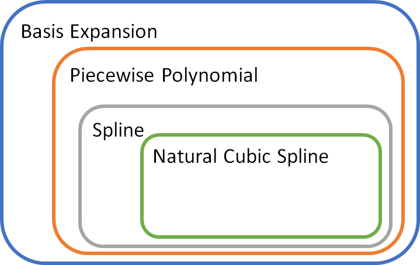
</center>


## 区分的多項式

区間ごとに異なる多項式モデルに従う

```{r include=FALSE}
seg <- rep("seg1", N)
seg[x > quantile(x, 1/3)] <- "seg2"
seg[x > quantile(x, 2/3)] <- "seg3"
newx = seq(min(x), max(x), length = 500)
newseg <- rep("seg1", length(newx))
newseg[newx > quantile(x, 1/3)] <- "seg2"
newseg[newx > quantile(x, 2/3)] <- "seg3"
newdata <- data.frame(x = newx, seg = newseg) 
o1 <- lm(y ~ seg); p1 <- predict(o1, newdata)
o2 <- lm(y ~ x*seg); p2 <- predict(o2, newdata)
o3 <- lm(y ~ x*seg + I(x^2)*seg); p3 <- predict(o3, newdata)
o4 <- lm(y ~ x*seg + I(x^2)*seg + I(x^3)*seg); p4 <- predict(o4, newdata)
dat1 <- data.frame(x, y)
dat2 <- lapply(1:4, function(i) newdata) %>% bind_rows()
dat2$y <- c(p1, p2, p3, p4)
dat2$model <- lapply(c("piecewise constant", "piecewise linear", 
                       "piecewise quadratic", "piecewise cubic"),
                     rep, nrow(dat2)/4) %>% unlist()
dat2$model <- factor(dat2$model, levels <- unique(dat2$model))
g <- ggplot(dat1, aes(x, y)) +
  theme(panel.background = element_rect(fill = "grey97"),
        panel.grid.major = element_blank(),
        panel.grid.minor = element_blank(),
        axis.ticks = element_blank(),
        axis.text  = element_blank(),
        axis.title = element_blank(),
        #strip.text.x = element_blank(), 
        strip.background = element_blank()) +
  geom_point(size = 2) + 
  geom_path(data = dat2, aes(x, y, group = seg), 
            color = "blue", size = 1.5, alpha = 0.5) + 
  geom_vline(xintercept = quantile(x, 1/3), linetype = 2, color = "grey20") + 
  geom_vline(xintercept = quantile(x, 2/3), linetype = 2, color = "grey20") + 
  facet_wrap(~ model)
```

```{r echo=FALSE, fig.height=3.5, fig.width=8}
plot(g)
```

自由度(i.e. パラメータ数) $=$ 区間数 × (次元 + 1)

E.g. 3次・3区間 ⇒ 3 *(3 + 1) = 12 パラメータ

自由度が高い ⇔ モデルが複雑


## Rで区分的多項式モデル 

区間を表す因子変数をつくり、交差項で回帰する

```{r, echo=TRUE}
X <- runif(50)
Y <- runif(50)
segment <- rep(1, length(X))
segment[x > quantile(X, 1/3)] <- 2
segment[x > quantile(X, 2/3)] <- 3
segment <- factor(segment)
lm(Y ~ X*segment + I(X^2)*segment + I(X^3)*segment)
```

## 連続微分条件で滑らかにする

区分的多項式モデル$f(X)$に次のような制約をつけることで、
滑らかなモデルを表現

1. 各区分点で $f(X)$ が連続
1. 各区分点で $f'(X)$ が連続
1. 各区分点で $f''(X)$ が連続
......

```{r, include=FALSE}
u <- x - quantile(x, 1/3); u <- u*(u>=0)
v <- x - quantile(x, 2/3); v <- v*(v>=0)
newdata <- newdata %>% 
  mutate(u = x - quantile(x, 1/3), v = x - quantile(x, 2/3)) %>%
  mutate(u = u*(u>=0), v = v*(v>=0))
o5 <- lm(y ~ x + I(x^2) + I(x^3) + u + I(u^2) + I(u^3) + v + I(v^2) + I(v^3))
o6 <- lm(y ~ x + I(x^2) + I(x^3) + I(u^2) + I(u^3) + I(v^2) + I(v^3))
o7 <- lm(y ~ x + I(x^2) + I(x^3) + I(u^3) + I(v^3))
p5 <- predict(o5, newdata)
p6 <- predict(o6, newdata)
p7 <- predict(o7, newdata)
dat3 <- lapply(1:4, function(i) newdata) %>% bind_rows()
dat3$y <- c(p4, p5, p6, p7)
dat3$model <- lapply(c("discontinuous", "continuous", 
                       "continuous 1st derivative", "continuous 2nd derivative"),
                     rep, nrow(dat3)/4) %>% unlist()
dat3$model <- factor(dat3$model, levels = unique(dat3$model))
g <- ggplot(dat1, aes(x, y)) +
  theme(panel.background = element_rect(fill = "grey97"),
        panel.grid.major = element_blank(),
        panel.grid.minor = element_blank(),
        axis.ticks = element_blank(),
        axis.text  = element_blank(),
        axis.title = element_blank(),
        #strip.text.x = element_blank(), 
        strip.background = element_blank()) +
  geom_point(size = 2) + 
  geom_path(data = dat3, aes(x, y, group = seg), 
            color = "blue", size = 1.5, alpha = 0.5) + 
  geom_vline(xintercept = quantile(x, 1/3), linetype = 2, color = "grey20") + 
  geom_vline(xintercept = quantile(x, 2/3), linetype = 2, color = "grey20") + 
  facet_wrap(~ model)
```

```{r echo=FALSE, fig.height=3.5, fig.width=8}
plot(g)
```


## 区分的多項式を表現する基底

<br />
<center>
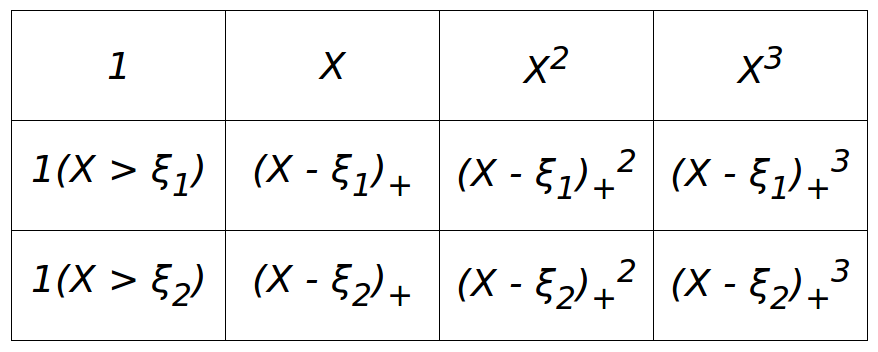
</center>
<br />

この12の基底で3次・3区間の区間的多項式モデルを表現できる

$\xi_1, \xi_2$ は区分点を表す ($\xi_1 < \xi_2$ とする)

$1(\cdot)$ はカッコ内が真なら１、そうでなければ0になる関数

$(\cdot)_+$ は正の部分を表す（負の数はゼロに切り捨て）


## 区分的多項式を表現する基底

<br />
<center>
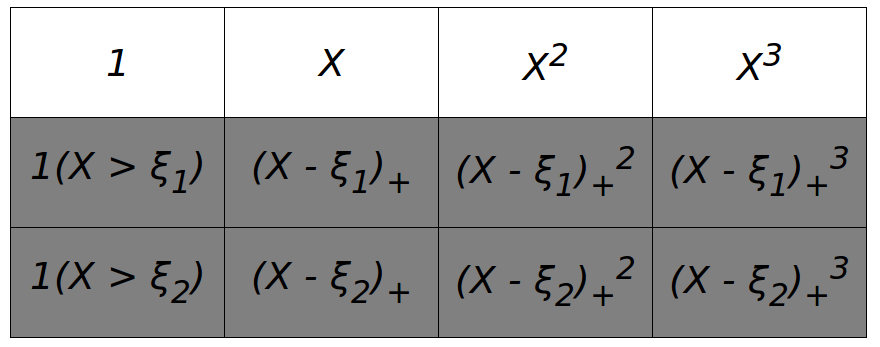
</center>
<br />

$X \le \xi_1$ のとき、網掛け部分はゼロ

上段の４変数で３次多項式を表現


## 区分的多項式を表現する基底

<br />
<center>
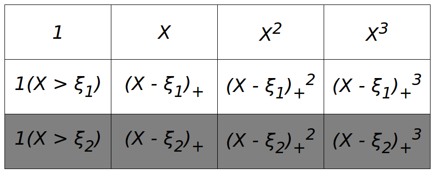
</center>
<br />

$\xi_1 <  X \le \xi_2$ のとき、

新たに加わった中段の４変数で異なる３次多項式を表現


## 区分的多項式を表現する基底

<br />
<center>
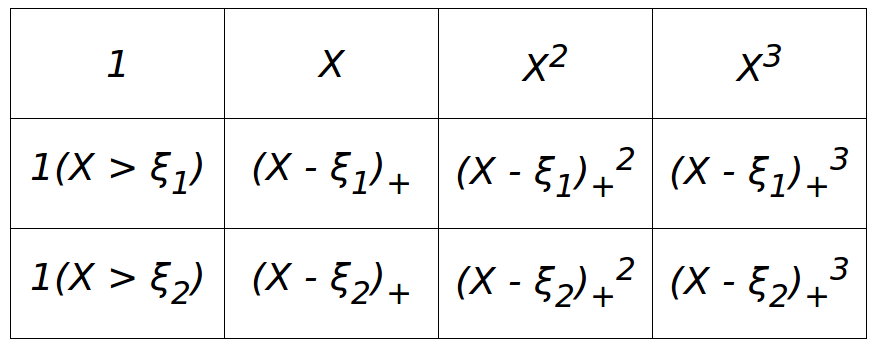
</center>
<br />

$X > \xi_2$ のとき、

新たに加わった下段の４変数で異なる３次多項式を表現

結果、3区間で異なる3次多項式を表現することができる


## 連続性制約を課した場合の基底

<br />
<center>
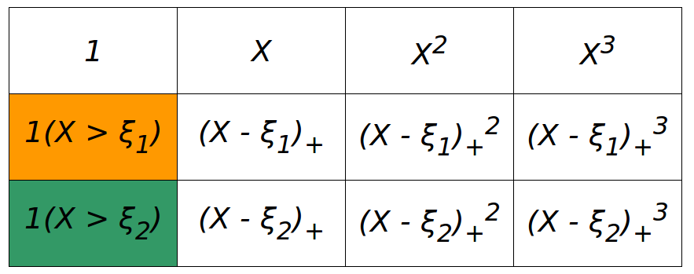
</center>
<br />


オレンジのセルは $X = \xi_1$ において非連続

緑のセルは $X = \xi_2$ において非連続

⇛ これらのセルの係数はゼロにする必要がある

## 連続性制約を課した場合の基底

<br />
<center>
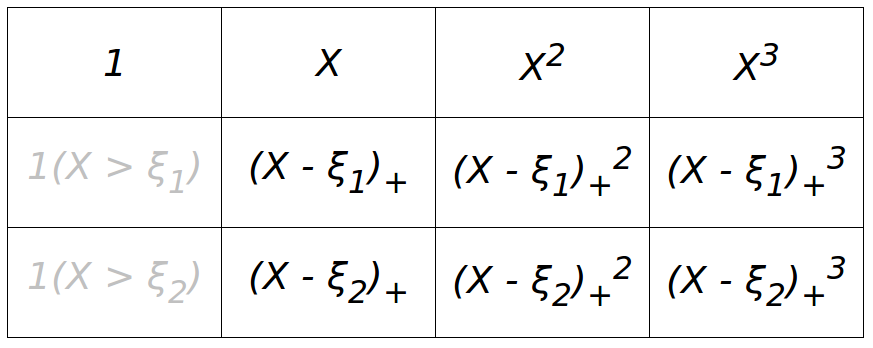
</center>
<br />

この10変数で、連続制約付きの3次区分的多項式を表現できる


## 1次導関数までの連続性を課す場合の基底

<br />
<center>
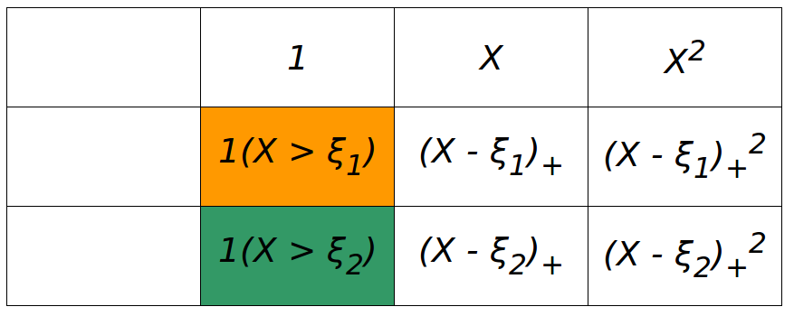
</center>
<br />

各項を微分したものを考える（係数は無視してよい）

オレンジのセルは $X = \xi_1$ において非連続

緑のセルは $X = \xi_2$ において非連続


## 1次導関数までの連続性を課す場合の基底

<br />
<center>
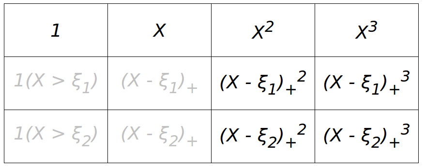
</center>
<br />

この8変数で、1階連続微分制約付きの3次区分的多項式を表現できる


## 2次導関数までの連続性を課す場合の基底

<br />
<center>
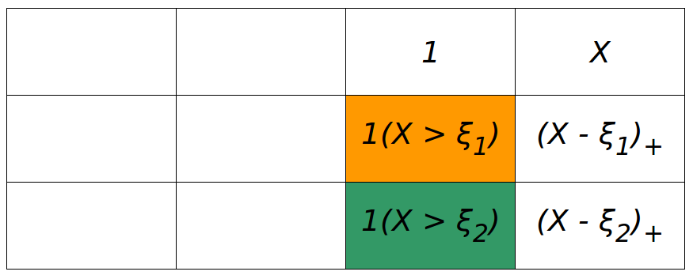
</center>
<br />

各項をもう1度微分する

オレンジのセルは $X = \xi_1$ において非連続

緑のセルは $X = \xi_2$ において非連続


## 2次導関数までの連続性を課す場合の基底

<br />
<center>
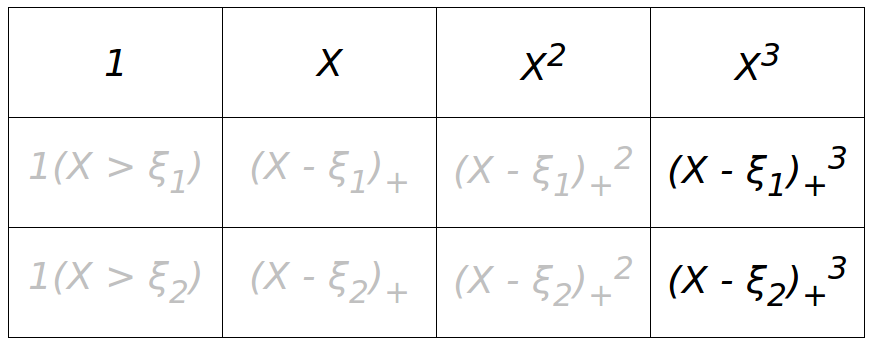
</center>
<br />

この6変数で、2階連続微分制約付きの3次区分的多項式を表現できる (Exercise 5.1)


## 3次導関数までの連続性を課す場合の基底

<br />
<center>
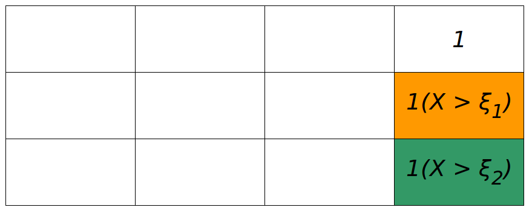
</center>
<br />

各項をもう1度微分する

オレンジのセルは $X = \xi_1$ において非連続

緑のセルは $X = \xi_2$ において非連続

## 3次導関数までの連続性を課す場合の基底

<br />
<center>
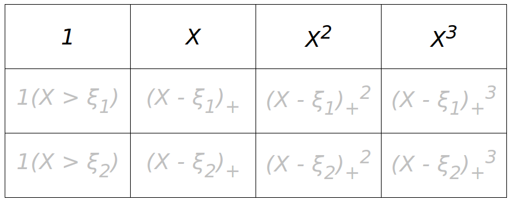
</center>
<br />

この4変数で、3階連続微分制約付きの3次区分的多項式を表現できる

これは、通常の3次多項式モデルと同じ


## スプラインと3次自然スプライン

- 次元数と同じ階数の連続微分を課すと、ただの多項式モデルに帰着する

- （次元数 - 1）階の連続微分を課した区分的多項式モデルのことを「**スプライン** (Spline)」という

- 3次スプラインがよく使われる

- スプラインに、両端の外側には線形制約（2次以上の項なし）を課したものを「**自然スプライン** (Natural spline)」という

- 自然スプラインは、両端の予測誤差が大きくなりがちな傾向を緩和する

- 自然スプラインの自由度は、

区間数 × 4変数 - (区間数 - 1) × 3制約 - 4 = 区間数 - 1 

## スプラインと3次自然スプライン

```{r include=FALSE}
qt1 <- quantile(x, c(1/3, 2/3))
qt2 <- quantile(x, (1:6)/7)
z <- bs(x, knots = qt1)
z <- as.data.frame(z) %>% setNames(paste("z", seq(ncol(z)), sep = ""))
o8 <- lm(y ~ ., data = z)  # spline
w <- ns(x, knots = qt1)
w <- as.data.frame(w) %>% setNames(paste("w", seq(ncol(w)), sep = ""))
o9 <- lm(y ~ ., data = w)  # natural spline

u <- bs(x, knots = qt2)
u <- as.data.frame(u) %>% setNames(paste("u", seq(ncol(u)), sep = ""))
o10 <- lm(y ~ ., data = u)  # spline
v <- ns(x, knots = qt2)
v <- as.data.frame(v) %>% setNames(paste("v", seq(ncol(v)), sep = ""))
o11 <- lm(y ~ ., data = v)  # natural spline

extra <- diff(range(newx)) * 0.1
newx <- seq(min(newx) - extra, max(newx) + extra, length = 500)
newz <- bs(newx, knots = qt1) %>% as.data.frame() %>%
  setNames(paste("z", seq(ncol(z)), sep = ""))
neww <- ns(newx, knots = qt1) %>% as.data.frame() %>%
  setNames(paste("w", seq(ncol(w)), sep = ""))
newu <- bs(newx, knots = qt2) %>% as.data.frame() %>%
  setNames(paste("u", seq(ncol(u)), sep = ""))
newv <- ns(newx, knots = qt2) %>% as.data.frame() %>%
  setNames(paste("v", seq(ncol(v)), sep = ""))
newdata <- bind_cols(data.frame(x = newx), 
                     newz, neww, newu, newv)
p8 <- predict(o8, newdata, interval = "prediction", level = 0.9)
p9 <- predict(o9, newdata, interval = "prediction", level = 0.9)
p10 <- predict(o10, newdata, interval = "prediction", level = 0.9)
p11 <- predict(o11, newdata, interval = "prediction", level = 0.9)

dat4 <- lapply(1:4, function(i) newdata) %>% bind_rows()
dat4$y  <- c(p8[, 1], p9[, 1], p10[, 1], p11[, 1])
dat4$lb <- c(p8[, 2], p9[, 2], p10[, 2], p11[, 2])
dat4$ub <- c(p8[, 3], p9[, 3], p10[, 3], p11[, 3])
dat4$model <- lapply(c("spline, 3 regions", "natural spline, 3 regions", 
                       "spline, 7 regions", "natural spline, 7 regions"),
                     rep, nrow(dat4)/4) %>% unlist()
dat4$model <- factor(dat4$model, levels = unique(dat4$model))
dat5 <- data.frame(qt = c(qt1, qt1, qt2, qt2))
dat5$model <- Map(rep, levels(dat4$model), 
                  list(length(qt1), length(qt1), length(qt2), length(qt2))) %>% 
  unlist() %>% unname() %>% factor(levels = levels(dat4$model))
g <- ggplot(dat1, aes(x, y)) +
  theme(panel.background = element_rect(fill = "grey97"),
        panel.grid.major = element_blank(),
        panel.grid.minor = element_blank(),
        axis.ticks = element_blank(),
        axis.text  = element_blank(),
        axis.title = element_blank(),
        #strip.text.x = element_blank(), 
        strip.background = element_blank()) +
  geom_vline(xintercept = min(x), linetype = 3, color = "green") +
  geom_vline(xintercept = max(x), linetype = 3, color = "green") +
  geom_point(size = 2) + 
  geom_ribbon(data = dat4, aes(x, ymin = ub, ymax = lb), alpha = 0.2) +
  geom_path(data = dat4, aes(x, y), 
            color = "blue", size = 1.5, alpha = 0.5) + 
  geom_vline(aes(xintercept = qt), dat5, linetype = 2, color = "grey20") +
  facet_wrap(~ model)
```

```{r echo=FALSE, fig.height=3.5, fig.width=8.5}
plot(g)
```

- 帯は90％の予測区間

- 緑の線がスプラインの両端.　その外側では自然スプラインは線形

- 自然スプラインの方が両端での誤差が小さい


## Rでスプライン基底を生成

```{r, echo=TRUE}
library(splines)
X <- runif(50)
B <- bs(X, knots = c(0.33, 0.67)); head(B, 3) # 3次スプライン
N <- ns(X, knots = c(0.33, 0.67)); head(N, 3) # 3次自然スプライン
```

- `knots` は区分点の位置
- `bs` の自由度は 6 （= 5 変数 + 定数項）
- `ns` の自由度は 4 （= 2 ノット + 2 両端ノット）


## 3次自然スプラインを用いた特徴抽出

<br />
<br />
<br />
このセクションでは、スプラインをちょっと変わった方法で使っているので注意
<br />
<br />

- これまで：スプラインを基底として回帰変数に用いる
- ここ　　：スプラインを基底展開に利用する


## 基底展開は特徴抽出でもある

$x \in \mathbb{R}^p$, $H \in \mathbb{R}^{p \times M}$ として、基底 $x^* \in \mathbb{R}^M$ を
\[ x^* = H^T x \]

と定義する

$p > M$ であれば、 $x^*$ は $p$ 個の情報を $M$ 個の変数に**集約**したものになる

<br />

- 変数が減る ⇛ バイアスが増えて分散が減る

- 既存の知識から適切な集約方法がわかっている時には、バイアスはあまり減らないので特に有用


## 音素認識の例 (5.2.3)

- 説明変数 $x.1, \dots, x.256$: 各周波数 (1~256) の波の強さ (i.e. $p = 256$)
- 被説明変数 $g$: 音が "aa" か "ao" か（2値分類問題）
- 256変数は多すぎる + 互いに相関が強い ⇛ 集約したい
- 3次自然スプラインが使える！

```{r}
phenome <- read.csv("phoneme.data", as.is = TRUE) %>%
  filter(g %in% c("aa", "ao")) 
head(phenome[, c("x.1", "x.2", "x.3", "x.4", "x.5", "x.6")], 4)
cat("....")
head(phenome[, c("x.251", "x.252", "x.253", "x.254", "x.255", "x.256", "g")], 4)
```

## 音素認識の例 (5.2.3)

1. 集約する変数の数 $M$ を決める（例では $M = 12$）
1. 行列 $H$ を 1~256 の周波数に対する、自由度 $M$ のスプライン行列とする
1. 特徴量を $x^* = H^T x$ に集約する

```{r echo=TRUE}
H <- ns(1:256, df = 12)
X <- as.matrix(phenome[, paste("x.", 1:256, sep = "")])
Z <- X %*% H
head(Z, 3)
``` 

## 音素認識の例 (5.2.3)

```{r}
dat <- as.data.frame(H) %>% setNames(paste("h", seq(ncol(H)), sep = ""))
dat$frequency = 1:256
dat <- melt(dat, id.vars = "frequency")
g <- ggplot(dat, aes(frequency, value)) +
  geom_line(size = 1.3) + 
  facet_wrap(~variable, nrow = 3, ncol = 4) +
  theme(panel.background = element_rect(fill = "grey97"),
        #panel.grid.major = element_blank(),
        panel.grid.minor = element_blank(),
        axis.ticks.y = element_blank(),
        axis.text.y  = element_blank(),
        #strip.text.x = element_blank(), 
        strip.background = element_blank(),
        axis.title.y = element_blank()) 
```

```{r echo=FALSE, fig.width = 11, fig.height = 4}
plot(g)
```

各スプライン基底は特定の範囲の周波数を重点的に集約している


## 平滑化スプライン


## 平滑化スプライン

$x \in[a, b]$ において $y$ を予測するモデルについて、次の最適化問題を考える

\[ 
  \min_{f \in C^2} \sum_{i=1}^N \left( y_i - f(x_i) \right)^2 + 
  \lambda \int_{a}^{b} \left( f''(t) \right)^2 dt
 \]

- $C^2$: 連続2階微分可能な**関数の集合**
- $\lambda > 0$: 平滑化パラメータ  

### トレードオフ

- モデルを複雑にすれば、$\sum_{i=1}^N \left( y_i - f(x_i) \right)^2$ は小さくなる
- モデルを複雑にすると、$\int_{a}^{b} \left( f''(t) \right)^2$ は大きくなる
- $\lambda \to 0$ ⇛ $f$ は 各データ点を通る曲線
- $\lambda \to +\infty$ ⇛ $f$ は 線形モデル


## 平滑化スプライン

\[ 
  \min_{f \in C^2} \sum_{i=1}^N \left( y_i - f(x_i) \right)^2 + 
  \lambda \int_{a}^{b} \left( f''(t) \right)^2 dt
\]

の解は、「$(x_1, x_2, \dots, x_N)$ をノットとする**3次自然スプライン**」になる！

<br />

- あらゆる関数（2次連続微分可能）の中で、3次自然スプラインが最も「好ましい」
- これを**平滑化スプライン**という.


## 証明（Exercise 5.7）

$\tilde{g}(x)$ を最適化問題の解とする.
$\tilde{g}$が、各 $x_i$ において通る点を $z_i = \tilde{g}(x_i)$ と置く.

一方、$g(x)$ を $(x_1, x_2, \dots, x_N)$ をノットとし、かつ$N$個の点 $(x_i, z_i)$ を通るような
3次自然スプラインとする.
3次自然スプラインの自由度は$N$なので、このような $g$ は必ず見つかる.

この時、全ての$x \in [a, b]$において、$g(x) = \tilde{g}(x)$であることを示す.

### Step (1): $h(x) = \tilde{g}(x) - g(x)$ とすると、$\int_{a}^{b} g''(x)h''(x)dx = 0$.

部分積分によって、
\[
  \int_{a}^{b} g''(x)h''(x)dx = \left[ g''(x)h'(x)\right]_{a}^{b} - \int_{a}^{b} g'''(x)h'(x)dx 
\]
ここで、$g$は自然スプラインなので、$g''$は両端ではゼロになる.したがって、第1項はゼロ.


## 証明（Exercise 5.7）

また、$g$は3次の区分的多項式であるから、$g'''(x)$は各区間内で定数になる.
そこで、区間$(x_j, x_j+1)$における$g'''(x)$の値を$g_j'''$と置く. 
すると  

\begin{align*}
\int_{a}^{b} g''(x)h''(x)dx &= - \int_{a}^{b} g'''(x)h'(x)dx \\
 &= -\sum_{j=1}^{N-1} g_j'''\int_{x_j}^{x_{j+1}}h'(x)dx \\
 &= -\sum_{j=1}^{N-1} g_j'''\left[ h(x) \right]_{x_j}^{x_{j+1}} \\
 &= -\sum_{j=1}^{N-1} g_j'''(h(x_{j+1})-h(x_j) ) =0
\end{align*} 
最後の等式は、$h(x_j) = \tilde{g}(x_j)-g(x_j) = z_j-z_j = 0$を用いている.


## 証明（Exercise 5.7）

### Step (2): $\int_{a}^{b} \tilde{g}''(x)^2dx \ge \int_{a}^{b} g''(x)^2dx.$

\begin{align*}
\tilde{g}''(x) &= h''(x) + g''(x) \\
\tilde{g}''(x)^2 &= h''(x)^2 + 2h''(x)g''(x) + g''(x)^2 \\
\int_{a}^{b} \tilde{g}''(x)^2 dx &= \int_{a}^{b} h''(x) dx + \int_{a}^{b} 2h''(x)g''(x) dx + \int_{a}^{b} g''(x) dx \\
\int_{a}^{b} \tilde{g}''(x)^2 dx &= \int_{a}^{b} h''(x)^2 dx  + \int_{a}^{b} g''(x)^2 \\
\int_{a}^{b} \tilde{g}''(x)^2 dx &\ge \int_{a}^{b} g''(x)^2dx
\end{align*}
また、両辺が等しいのは$h(x)$が全ての$x \in [a,b]$においてゼロの時のみ.


## 証明（Exercise 5.7）

### Step (3)

一方、$\tilde{g}$ は最適化問題の解であるので、$\int_{a}^{b} \tilde{g}''(x)^2 dx \le \int_{a}^{b} g''(x)^2dx$. 
よって、$\int_{a}^{b} \tilde{g}''(x)^2 dx = \int_{a}^{b} g''(x)^2dx$.
したがって、全ての$x \in [a,b]$について、$h(x) = \tilde{g}(x) - g(x) = 0$. (*証明終*) 


## 平滑化スプラインの行列表現

3次自然スプラインの基底を$(N_1, \dots, N_N)$とおくと
\[ f(x) = \sum_{j=1}^{N}N_j(x) \theta_j  \]

行列$\mathbf{N}, \mathbf{\Omega}$を、
$\mathbf{N}_{ij} = N_{j}(x_i)$,
$\mathbf{\Omega}_{jk} = \int N''_j(t)N''_k(t) dt$ と定義すると、最小化問題は

\[ \min_{\theta} (y-\mathbf{N}\theta)^T(y-\mathbf{N}\theta) + \lambda \theta^T\mathbf{\Omega}\theta. \]

この解, 予測値は
\[ \widehat{\theta} =  (\mathbf{N}^T\mathbf{N} + \lambda\mathbf{\Omega})^{-1} \mathbf{N}^Ty, \]

\[ \widehat{y} =  \mathbf{N}(\mathbf{N}^T\mathbf{N} + \lambda\mathbf{\Omega})^{-1} \mathbf{N}^Ty, \]
と書ける.


## 平滑化スプラインの自由度

推定値が$\widehat{y} =  \mathbf{H} y$ と書けるタイプ（線形平滑化）のモデルについて、その自由度を

\[ \mathrm{trace}(\mathbf{H}) \]
で定義する.

平滑化スプラインの場合：
$\mathbf{S}_\lambda = \mathbf{N}(\mathbf{N}^T\mathbf{N} + \lambda\mathbf{\Omega})^{-1} \mathbf{N}^T$
と置いて、
\[ \mathrm{df}_\lambda = 
  \mathrm{trace}(\mathbf{S}_\lambda) 
\]


性質：

1. $\mathrm{df}_\lambda$ は$\lambda$が大きくなるにつれて減少していく
1. $\lambda \to 0$のとき、$\mathrm{df}_\lambda \to N$
1. $\lambda \to \infty$のとき、$\mathrm{df}_\lambda \to 2$


## Traceオペレータ

- 正方行列$\mathbf{A}$について、$\mathrm{trace}(\mathbf{A})$はその対角要素の和：
\[ \mathrm{trace}(\mathbf{A})  = \sum_{i} A_{ii}\]

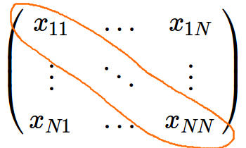

## Traceオペレータ

- $\mathrm{trace}(\mathbf{A})$ は行列$\mathbf{A}$の固有値の和に等しい（証明略）

- 行列 $\mathbf{A} (n \times m)$, $\mathbf{B} (m \times n)$について、
$\mathrm{trace}(\mathbf{AB}) = \mathrm{trace}(\mathbf{BA})$ が成り立つ（証明略）

<br />

- $\lambda = 0$のとき、$\mathbf{S}_\lambda = \mathbf{N}(\mathbf{N}^T\mathbf{N})^{-1} \mathbf{N}^T$. 
よって、$\mathrm{trace}(\mathbf{S}_\lambda) = 
\mathrm{trace}\left(\mathbf{N}(\mathbf{N}^T\mathbf{N})^{-1} \mathbf{N}^T\right) = 
\mathrm{trace}\left(\mathbf{N}^T \mathbf{N}(\mathbf{N}^T\mathbf{N})^{-1} \right) = 
\mathrm{trace}\left(\mathbf{I}_N\right) = N$.


## *Reinsch*形式


### $\mathbf{S}_\lambda = (\mathbf{I} + \lambda \mathbf{K})^{-1}$ と書ける 

ただし、$\mathbf{K}$は$\lambda$に依存しない
<br />

導出 (Exercise 5.9):

$\mathbf{N}$は$N$次の正方行列. $\mathbf{N}$が正則なら、
\begin{align*}
\mathbf{S}_{\lambda}^{-1} 
&= (\mathbf{N}^T)^{-1}(\mathbf{N}^T\mathbf{N} + \lambda\mathbf{\Omega}) \mathbf{N}^{-1} \\
&= \mathbf{I} + \lambda (\mathbf{N}^T)^{-1} \mathbf{\Omega} \mathbf{N}^{-1} \\
&= \mathbf{I} + \lambda \mathbf{K}
\end{align*}
ここで$\mathbf{K} = (\mathbf{N}^T)^{-1} \mathbf{\Omega} \mathbf{N}^{-1}.$


## $\mathbf{S}_{\lambda}$の固有値

$d_k$ を $\mathbf{K}$の固有値とすると

- $\rho_k(\lambda) = (1 + \lambda d_k)^{-1}$は$\mathbf{S}_{\lambda}$の固有値
- $(d_1, \dots, d_N)$の中には少なくとも2つのゼロが含まれる
- $d_k \ge 0$


<br />

上記から次の性質が示される.

- $\mathbf{S}_{\lambda}$ の固有値は$\lambda$について単調減少する
- $\mathrm{df}_\lambda = \mathrm{trace}(\mathbf{S}_{\lambda}) = \sum_{k}\rho_k(\lambda)$ なので、
自由度も$\lambda$について単調減少する
- $\lambda \to 0$のとき、$\mathrm{df}_\lambda \to N$
- $\lambda \to \infty$のとき、$\mathrm{df}_\lambda \to 2$


## 固有値について

- 正方行列$\mathbf{A}$ について、ベクトル$v$ とスカラー$\rho$ が
\[ \mathbf{A} v = \rho v\]
を満たすとき、 $\rho$を$\mathbf{A}$の**固有値**、$v$を対応する**固有ベクトル**と呼ぶ.

- $\rho \not= 0$が$\mathbf{A}$の固有値で、かつ$\mathbf{A}$が正則なら、$\rho^{-1}$は$\mathbf{A}^{-1}$の固有値（証明略）

- $\mathbf{A}$が対称行列の場合、固有値は全て実数で、かつすべての固有ベクトルが互いに直交するように選ぶことができる（証明略）

- $\mathbf{A}$が対称行列の場合、$\mathbf{A}$は直交行列$\mathbf{Q}$と対角行列$\mathbf{\Lambda}$を用いて次のように分解することができる（証明略）. これを**固有値分解**という.
\[ \mathbf{A} = \mathbf{Q} \mathbf{\Lambda} \mathbf{Q}^T \]


## 固有値について

- 正方行列$\mathbf{A}$について、任意のベクトル$x$について
\[ x^T A x \ge 0 \] 
が成り立つ場合、$\mathbf{A}$は**半正定値** (positive semidefinite)という.

- 同様に $x^T A x \le 0$ なら**半負定値** (negative semidefinite), 
$x^T A x > 0$ なら**正定値** (positive definite), 
$x^T A x < 0$ なら**負定値** (negative definite)という.

- 半正定値行列の固有値は全て非負（証明略）


## $\rho_k(\lambda) = (1 + \lambda d_k)^{-1}$は$\mathbf{S}_{\lambda}$の固有値

$d_k$は$\mathbf{K}$の固有値なので、$v$ を対応する固有ベクトルとすると$d_k \mathbf{K} = d_k v$と書ける.
\[ \mathbf{S}_{\lambda}^{-1}v = (\mathbf{I} + \lambda \mathbf{K})v = v + \lambda K v = v + \lambda d_k v = (1 + \lambda d_k)v. \]
よって、$(1 + \lambda d_k)$は$\mathbf{S}_{\lambda}^{-1}$の固有値 (固有ベクトルは$v$).
したがって、$(1 + d_k)^{-1}$は$\mathbf{S}_{\lambda}$の固有値.


## $(d_1, \dots, d_N)$の中には少なくとも2つのゼロが含まれる

$(N_1, \dots, N_N)$はスプライン基底なので、定数項と1次の項を含む.
簡単化のため、$N_0, N_1$を定数項と1次の項とすると、$N_1'' = 0, N_2''=0$.
したがって、全ての$j$について、$\mathbf{\Omega}_{1,j} = \mathbf{\Omega}_{2,j}=\mathbf{\Omega}_{j,1} =\mathbf{\Omega}_{j,2} = 0$

ここで、$v_1 = (1, 0, 0, \dots)', v_2(0, 1, 0, \dots)'$ とすれば、
\[ \mathbf{\Omega} v_1 = 0 = 0 \times v_1, \mathbf{\Omega} v_2 = 0 = 0 \times v_2\]
となるから、$\mathbf{\Omega}$は固有値ゼロを2つ以上持つ.

さらに、$\mathbf{K} = (\mathbf{N}^T)^{-1} \mathbf{\Omega} \mathbf{N}^{-1}$の固有値を考える.
ベクトル$u_1 = \mathbf{N} v_1$とすると、
\[
\mathbf{K} u_1 = (\mathbf{N}^T)^{-1} \mathbf{\Omega} \mathbf{N}^{-1} \mathbf{N} v_1 = 
(\mathbf{N}^T)^{-1} \mathbf{\Omega} v_1 = 0 \times u_1 
\]
となる. 同様に、$u_2 = \mathbf{K} v_2$ についても $\mathbf{K} u_2 = 0 \times u_2$ なので、
$\mathbf{K}$は固有値ゼロを2つ以上持つ.


## $d_k \ge 0$

各要素が$N_j''(x)$ になっているようなベクトル$N''$を考えると
$\mathbf{\Omega} = \int N''(t) N''(t)^T dt$ と書ける.
任意のベクトル$v$について、
\[ v^T \mathbf{\Omega} v= \int v^T N''(t) N''(t)^T v dt = \int  (N''(t)^T v)^2 dt \ge 0 \]
したがって$\mathbf{\Omega}$は半正定値.

\[ 
\mathbf{K} = (\mathbf{N}^T)^{-1} \mathbf{\Omega} \mathbf{N}^{-1} 
= (\mathbf{N}^T)^{-1} \mathbf{Q} \mathbf{\Lambda} \mathbf{Q}^T \mathbf{N}^{-1} 
= \mathbf{P}^T \mathbf{P} 
\]
ここで$\mathbf{P}  = \mathbf{\Lambda}^{1/2} \mathbf{Q}^T \mathbf{N}^{-1}$.
任意のベクトル$v$について、
\[ v^T \mathbf{K} v= v^T \mathbf{P}^T \mathbf{P} v = (\mathbf{P} v)^T (\mathbf{P} v)\ge 0 \]
したがって$\mathbf{K}$も半正定値なので、その固有値は非負.


## 平滑化スプラインの自由度（まとめ）

1. $\mathrm{df}_\lambda = \mathrm{trace}(\mathbf{S}_\lambda)$ で自由度を定義する
1. $\mathrm{df}_\lambda$ は$\lambda$が大きくなるにつれて減少していく
1. $\lambda \to 0$のとき、$\mathrm{df}_\lambda \to N$
1. $\lambda \to \infty$のとき、$\mathrm{df}_\lambda \to 2$


## $\lambda$ の自動決定


バイアスと分散のトレードオフ

1. 自由度が高い ⇛ 複雑なモデルを表現 ⇛ バイアスが小さいが、分散が大きい
1. 自由度が低い ⇛ シンプルなモデル ⇛ バイアスが大きいが分散が小さい


何らかの基準で両者のバランスを取るように自由度を調整する

**Leave-one-out cross validation**

\[ 
\mathrm{CV}(\hat{f}) = \frac{1}{N} \sum_{i=1}^{N} \left( y_i - \hat{f}_{\lambda}^{(-i)}(x_i) \right)^2
 \]

- $\hat{f}_{\lambda}^{(-i)}$ は$i$番目のデータを除いたモデルを表す
- 1つだけデータを除いてテスト用データとしてモデルの評価に利用する
- $\mathrm{CV}(\hat{f})$が小さくなるように$\lambda$を調整する

## Leave-one-out cross validation の計算

各$i$について、個別に$\hat{f}_{\lambda}^{(-i)}$を計算するのは時間がかかる

次の公式を用いると、計算が効率的になる

\begin{align*} 
\mathrm{CV}(\hat{f}) 
&= \frac{1}{N} \sum_{i=1}^{N} \left( y_i - \hat{f}_{\lambda}^{(-i)}(x_i) \right)^2 \\
&= \frac{1}{N} \sum_{i=1}^{N} \left( \frac{y_i - \hat{f}_{\lambda}(x_i)}{1-\mathrm{S}_\lambda(i,i)} \right)^2
\end{align*}

*証明の参考*：http://robjhyndman.com/hyndsight/loocv-linear-models/


## スプラインとロジスティック回帰

2値分類問題にもスプラインは使える.

\[ \mathrm{Pr}(Y=1 | X=x) = p(x) = \frac{\mathrm{e}^{f(x)}}{1 + \mathrm{e}^{f(x)}} \]
とモデル化する.

正則項つきの最大化問題は

\[ 
\max_{f \in C^2}\;\; \sum_{i=1}^{N} \left[ y_if(x_i)-\log \left(1+\mathrm{e}^{f(x_i)}\right) \right] 
- \frac{1}{2}\lambda \int f''(t)^2 dt 
\]
と書ける.
回帰分析のケースと同様の手順で、最適な$f(x)$は3次自然スプラインであることを示すことができる.

そこで、スプライン基底を用いて $f(x) = \sum_{j=1}^N N_j(x) \theta_j$ と置き、
最適な$(\theta_1, \dots, \theta_N)$を求める問題に帰着する


